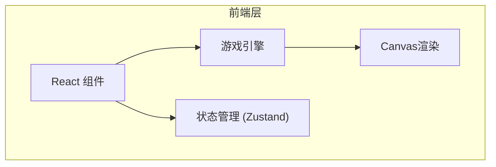

## 1. 架构设计



## 2. 技术描述

* **前端**: React\@18 + TypeScript + Vite + TailwindCSS + Zustand

* **初始化工具**: vite-init

* **游戏引擎**: 原生 Canvas 2D API 实现像素风格渲染

* **状态管理**: Zustand 管理游戏状态

## 3. 路由定义

| 路由    | 用途   |
| ----- | ---- |
| /     | 游戏首页 |
| /game | 游戏界面 |

## 4. 数据模型

### 4.1 角色模型

```typescript
interface Player {
  x: number;
  y: number;
  hp: number;
  maxHp: number;
  exp: number;
  maxExp: number;
  level: number;
  speed: number;
  skills: Skill[];
}
```

### 4.2 技能模型

```typescript
interface Skill {
  id: string;
  name: string;
  damage: number;
  cooldown: number;
  currentCooldown: number;
  level: number;
  maxLevel: number;
  type: 'active' | 'passive';
}
```

### 4.3 敌人模型

```typescript
interface Enemy {
  x: number;
  y: number;
  hp: number;
  maxHp: number;
  damage: number;
  speed: number;
  type: string;
  expReward: number;
}
```

## 5. 核心文件结构

```
src/
├── components/
│   ├── GameCanvas.tsx       # 游戏画布组件
│   ├── HUD.tsx               # 游戏状态栏
│   ├── SkillBar.tsx          # 技能栏
│   └── StartScreen.tsx       # 开始界面
├── hooks/
│   ├── useGameEngine.ts      # 游戏引擎逻辑
│   ├── usePlayer.ts          # 玩家状态
│   └── useSkills.ts          # 技能系统
├── utils/
│   ├── collision.ts          # 碰撞检测
│   ├── random.ts             # 随机数生成
│   └── pixelRender.ts        # 像素渲染工具
├── types/
│   └── game.ts               # 游戏类型定义
├── pages/
│   ├── Home.tsx              # 首页
│   └── Game.tsx              # 游戏页
└── store/
    └── useGameStore.ts       # Zustand状态管理
```

