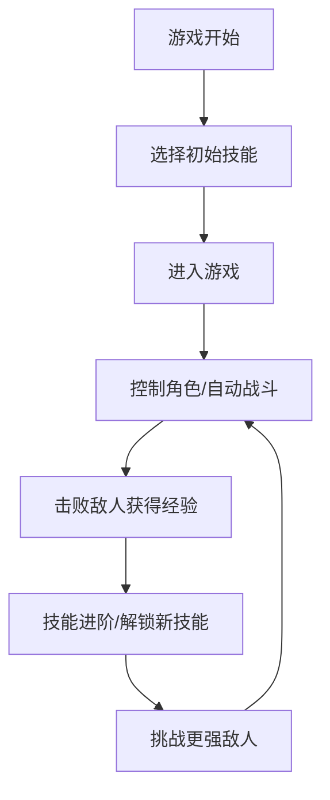

## 1. 产品概述
一款像素风格的大地图割草战斗游戏，支持放置战斗、技能自由组合和技能进阶玩法。
- 主要目标是提供沉浸式的割草爽感和策略性的技能搭配体验
- 市场价值在于填补像素风格割草游戏的技能深度

## 2. 核心 Features

### 2.1 用户角色
| 角色 | 注册方式 | 核心权限 |
|------|----------|----------|
| 玩家 | 直接开始游戏 | 控制角色、选择技能、战斗 |

### 2.2 功能模块
1. **游戏首页**: 开始游戏、技能选择
2. **游戏界面**: 大地图、角色、敌人、技能释放
3. **技能面板**: 技能树、进阶系统

### 2.3 页面详情
| 页面名称 | 模块名称 | 功能描述 |
|---------|---------|---------|
| 游戏首页 | 开始按钮 | 点击进入游戏 |
| 游戏首页 | 技能预览 | 展示可选择的技能 |
| 游戏界面 | 大地图 | 无限滚动地图，包含不同地形 |
| 游戏界面 | 角色控制 | 支持键盘控制或放置模式 |
| 游戏界面 | 敌人系统 | 自动生成敌人，多种敌人类型 |
| 游戏界面 | 技能释放 | 点击释放技能，自动攻击 |
| 技能面板 | 技能树 | 技能解锁和进阶 |

## 3. 核心流程
玩家选择技能 → 进入游戏 → 控制角色或自动战斗 → 击败敌人获得经验 → 解锁新技能或进阶 → 继续挑战更强敌人

## 4. 用户界面设计

### 4.1 设计风格
- **主色调**: 深色背景 (#1a1a2e)、像素绿 (#16213e)、像素蓝 (#0f3460)、像素红 (#e94560)
- **按钮风格**: 像素风格，方形边框，悬停有像素抖动效果
- **字体**: Press Start 2P (像素字体)
- **布局风格**: 复古游戏风格，像素化渲染
- **图标**: 像素风格图标

### 4.2 页面设计概览
| 页面名称 | 模块名称 | UI元素 |
|---------|---------|--------|
| 游戏首页 | 标题 | 像素字体，发光特效 |
| 游戏首页 | 技能选择区 | 卡片式展示，悬停高亮 |
| 游戏界面 | 游戏画布 | 全屏Canvas，像素渲染 |
| 游戏界面 | HUD | 左上角血量、经验条 |
| 游戏界面 | 技能栏 | 底部技能快捷栏 |

### 4.3 响应性
桌面优先，适配不同屏幕尺寸

### 4.4 像素场景指引
- **环境**: 像素风格大地图，包含草地、森林、岩石等地形
- **渲染**: Canvas像素渲染，固定像素比例
- **动画**: 帧动画，像素风格粒子特效
- **交互**: 点击释放技能，键盘控制移动

